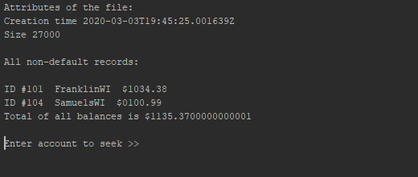
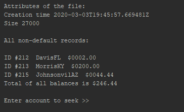
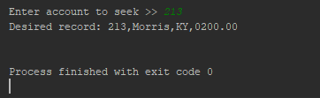
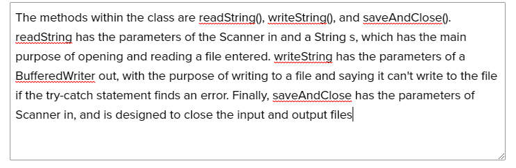
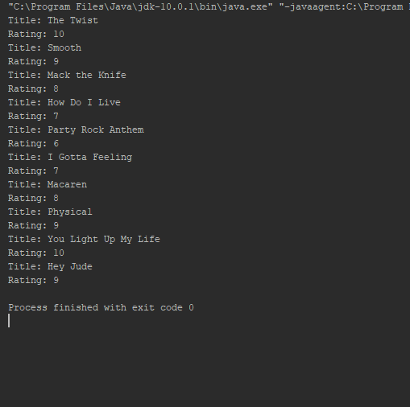
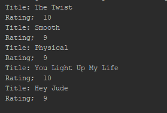

------------------------------------------------------------------------ 
This project is created to test the abilities of reading and writing data  
into a .txt file to be stored for later use. Then, the stored data can be  
accessed at a later date from a separate class, as well as find a data set 
------------------------------------------------------------------------

<h2>Chapter Thirteen / Lesson 1.2:</h2>

# Chapter Thirteen
<li>PURPOSE OF PROJECT: To write and read InState and OutState Files                          </li>
<li>DATE: 03.05.2020                                                                          </li>
<li>HOW TO START THIS PROJECT: Run CreateFilesBasedOnState and follow the instructions it says</li>
<li>AUTHORS: Cole Giles                                                                       </li>
<li>USER INSTRUCTIONS:                                                                        </li>

#5. Write out a paragraph on how the program is displaying text to the text file and another paragraph on how the program is reading from the text file. What is the method call that is making this happen?
            The CreateFilesBasedOnState writes data by first using the createEmptyFile method to create a blank space for the InState and OutState records to write into.
        Then, it asks the user to enter their info, where it will store the data to different variables. Next it concatenates all of the variables into one line,
        where it then writes into the text file. Finally, it asks if you want to enter more data, or it ends if the special code for QUIT is entered.

            
The ReadStateFile, on the other hand, uses the BufferedReader to be able to actually read the lines of text that you just stored. It will then ask you to
        enter a certain file to access, where it will begin to search for data. Then, it uses a while statement to go through each line to see if the account number
        is empty or not, and will only print off any of the accounts that have been filled in. It will also take all of their balances and add them into a total.
        Finally, it will ask if you want to access a certain account, and pull up that record.

#6. What is a try catch statement and why do you need the catch exception?
        A try catch statement is made to execute code blocks while looking out for errors. The catch part is needed because otherwise there will be no way to show an error.

#7.  Screen shot of console showing OutOfState or InState customers read from file. Display account info - Total - and specific customer.

------------------------------------------------------------------------ 
This is the project README file. Here, you should describe your project. 
Tell the reader (someone who does not know anything about this project) 
all he/she needs to know. The comments should usually include at least: 
------------------------------------------------------------------------

# Lesson 1.2.1
<li>PURPOSE OF PROJECT:                              </li>
<li>VERSION or DATE:                                 </li>
<li>HOW TO START THIS PROJECT:                       </li>
<li>AUTHORS:                                         </li>
<li>USER INSTRUCTIONS:                               </li>

#3. What are the methods of this class? Be sure to include parameters and return types. Using your own words, write a brief description of each method. 

#29. Which construct (for or while) do you think is better and why? 

I think that the while loop works better for this situation because it allows you to add as many songs as you want without altering code. If you had a song limit then a for loop would end up working better

#Conclusion 1. A for loop would work good when you only need a certain amount of loops to occur, such as reading through the length of a word. A while loop, on the other hamd, would be
useful if you weren't positive how long you would need the loop to be, and you needed it to run until a condition was met.

#Conclusion 2. The creation of tablets had promted the requirement to make a new Android OS, Honeycomb, to be able to run them. But,
maintaining the older versions was important because Android Phones didn't see any new updates until 4.0 Ice Cream Sandwich.

